# 🏥 NovaCare RAG Chatbot

## Overview

NovaCare Health Solutions Inc. is a fictional health insurance company
we created to build and evaluate a RAG (Retrieval-Augmented Generation)
chatbot. The company and all its policies, prices, and rules are entirely
made up — this guarantees the language model has never seen this data
during training, making it a clean testbed for measuring RAG's real impact.

The dataset contains 20 questions and answers covering NovaCare's plans,
coverage, claims, and policies. Our goal is to build a chatbot that can
accurately answer customer questions using only this document as its
knowledge base.

## Why a Fake Company?

A common mistake in RAG evaluation is using data the LLM already knows
from training. If the model can answer correctly without retrieval, you
cannot measure whether RAG is actually helping. By inventing NovaCare with
unique prices and specific policies, we guarantee the baseline LLM scores
zero without retrieval — making the value of RAG undeniable.

## The Data

The knowledge base is a single FAQ document containing 20 Q&A pairs covering
plans and premiums, deductibles and out-of-pocket maximums, coverage details
(mental health, ER, prescriptions, maternity), claims, appeals, cancellation
policies, wellness rewards, and telehealth services.

**Sample FAQ Entry**

Q1: What are NovaCare's available health insurance plans?
A: NovaCare offers three main plans: NovaCare Basic (monthly premium $187),
NovaCare Plus (monthly premium $334), and NovaCare Elite (monthly premium $521).
All plans include preventive care at no extra cost. NovaCare Elite additionally
covers dental and vision.

## Chunking Strategy

Most RAG tutorials chunk documents by character count — splitting every 500
characters with some overlap. This works for long prose but is wrong for FAQ data.

We use semantic chunking — each chunk is one complete Q&A pair. This produces
21 self-contained chunks (20 Q&A pairs + 1 header chunk). When the retriever
finds a chunk, it finds the full answer.

| Strategy | Semantic (ours) | Character-based |
|---|---|---|
| Chunk boundary | At each question | Every 500 chars |
| Each chunk | One complete Q&A | Random split |
| Context preserved | Always | Often split |
| Retrieval quality | High | Lower |

## Embeddings

To retrieve relevant chunks we need to convert text into numbers that
capture meaning. This is done by an embedding model.

### How it works

The embedding model processes one chunk at a time. Internally it splits
the text into tokens and uses self-attention so every token attends to
every other token within the same chunk. After all the attention layers,
all token vectors are averaged together into a single vector of 768 numbers.
This final vector represents the meaning of the entire chunk.

Our 21 chunks become 21 vectors of 768 dimensions each, stored in a matrix
of shape (21 x 768). This matrix is what we search at query time.

### Why nomic-embed-text

We chose nomic-embed-text because it is free, runs fully locally via Ollama,
and has strong performance on retrieval benchmarks. It was trained on 235
million text pairs from diverse sources including web pages, academic papers,
and books. It supports a context window of 8192 tokens which is more than
enough for our FAQ chunks.

### Limitation

The embedding model only sees one chunk at a time. It has no awareness of
other chunks in the document. For our NovaCare FAQ this is not a problem
because each Q&A pair is completely self-contained.

## Language Model

For answer generation we use llama3.2:3b — a 3 billion parameter model
developed by Meta and running locally via Ollama. It is free, requires no
API key, and fits in 12GB VRAM in full 16-bit precision.

## Embedding

After chunking, each chunk is converted into a single vector that captures
its meaning. This is done by the embedding model nomic-embed-text.

### How it works

The chunk is first split into tokens by the tokenizer. Each token gets a
vector from a frozen lookup table learned during training. These token
vectors then pass through transformer layers where every token attends to
every other token within the same chunk — building a contextual
representation. At the end, all token vectors are averaged together
(mean pooling) into one single vector of 768 numbers that represents
the meaning of the entire chunk. This process runs for all 21 chunks
producing a matrix of shape (21 x 768) stored in FAISS for retrieval.

### Model details

| Property | Value |
|---|---|
| Model | nomic-embed-text |
| Parameters | 137 million |
| Output dimensions | 768 |
| Context window | 8192 tokens |
| Training data | 235 million text pairs |
| Training objective | contrastive loss |

### Training

nomic-embed-text was trained on 235 million naturally occurring text pairs
from web pages, academic papers, books, and conversation data. The training
objective is contrastive loss — similar texts are pulled closer together in
vector space and dissimilar texts are pushed apart. This is different from
LLMs which are trained to predict the next token.

## Architecture

This chatbot is built with LangGraph — a framework for building stateful
AI pipelines as graphs. Instead of a simple linear chain (retrieve → generate),
we build a graph where each node can make decisions and route to different
nodes based on the result. This pattern is called Self-RAG.

### Shared State

Every node in the graph reads from and writes to a shared state object.
This state travels through the entire graph and carries all the information
needed at each step.

| Field | Type | Description |
|---|---|---|
| question | string | the user's original question |
| documents | list | retrieved chunks from FAISS |
| generation | string | the LLM's generated answer |
| is_relevant | boolean | did retrieved docs pass grading? |
| is_grounded | boolean | is the answer grounded in the docs? |
| retries | integer | how many times we tried to generate |

### Graph Nodes

The graph has 6 nodes each responsible for one task.

grade_question checks if the question is related to NovaCare. If not,
the graph routes to deflect immediately without doing any retrieval.

retrieve searches the FAISS index for the top 10 most similar chunks
to the user's question using vector similarity.

grade_documents checks if the retrieved chunks are actually relevant
to the question. If not, the graph routes to deflect.

generate sends the retrieved chunks and the question to the LLM and
produces an answer.

grade_generation checks if the answer is grounded in the retrieved
chunks and not hallucinated. If not, the graph routes back to generate
and tries again up to 3 times.

deflect returns a polite message telling the user the question is
outside the scope of NovaCare customer service.

### Graph Flow

### Retry Logic

The retry counter is incremented inside the generate node on every call.
The grade_generation node checks two conditions to decide where to go next.
If the answer is grounded it goes to END. If retries reaches 3 it also goes
to END to avoid infinite loops. Otherwise it routes back to generate for
another attempt.

## Retrieval

At query time the user question goes through the exact same embedding
pipeline as the chunks — tokenize, attention, mean pooling — producing
one 768-dim query vector. This vector is compared against all 21 chunk
vectors in FAISS using L2 distance. The 10 most similar chunks are
returned and passed to the LLM as context.

### Why L2 distance

L2 distance measures the straight line distance between two vectors in
768-dimensional space. Chunks that are semantically similar to the question
will have embeddings that are close together and therefore have a small L2
distance. FAISS searches all 21 vectors and returns the ones with the
smallest distance.

### Production upgrade

In production this FAISS index would be replaced with cuVS CAGRA —
NVIDIA's graph-based Approximate Nearest Neighbor algorithm that runs
entirely on GPU. CAGRA builds a proximity graph over all vectors and
traverses it during search, delivering 10-100x faster retrieval than
FAISS for large corpora. The code is architected so this is a one-line
swap.